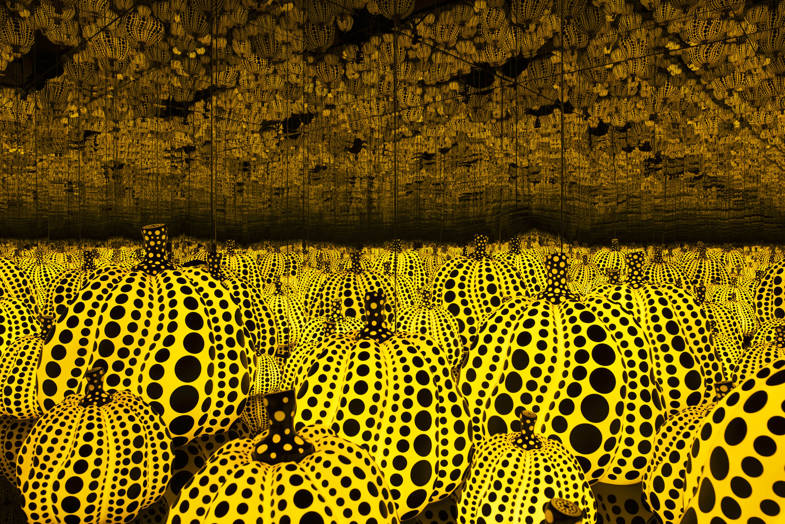
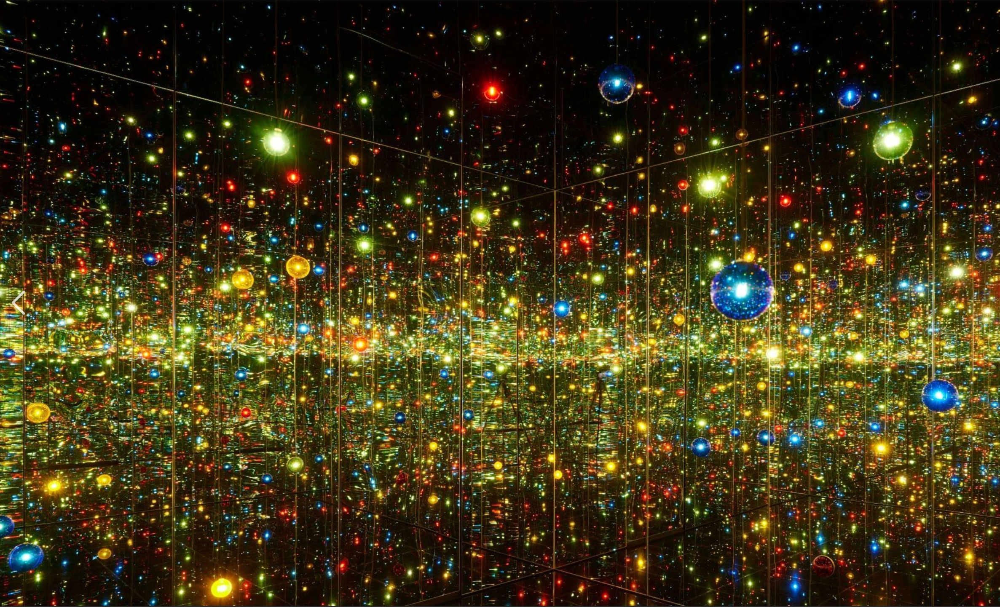
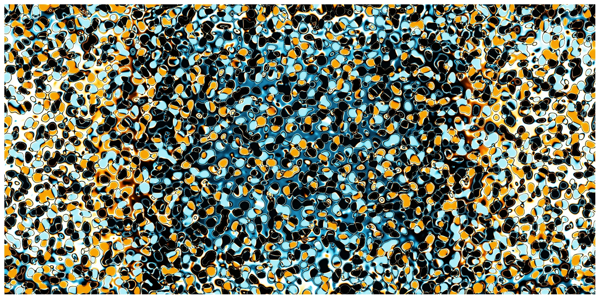

# Quiz 8_Design research for main assignment
## Part 1 Imaging Technique Inspiration
I was inspired by **Yayoi Kusama’s** polka dot hallucinations and emotions, and I want to use repeating patterns made by code to show how fear spreads and control is lost in *The Scream*, creating a feeling of chaos and falling apart.

## Part 2 Coding Technique Exploration
This generative art code uses coordinate shifts and color control to create animated effects. Repetition, mirroring, and rotation produce distorted, noise-like dot patterns that respond to interaction—visually expressing tension, anxiety, and a sense of scream.

[Example of online code link](https://openprocessing.org/sketch/1909817)